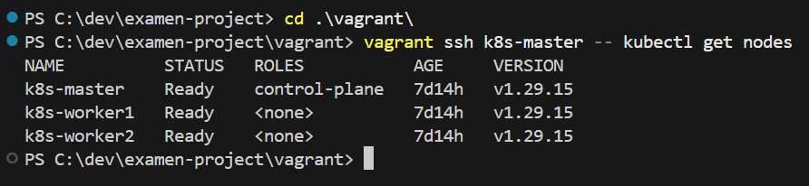
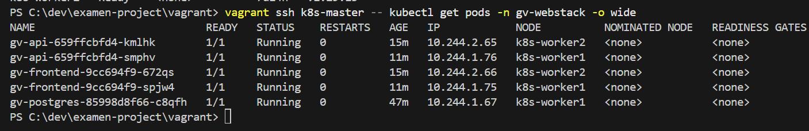
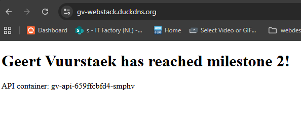
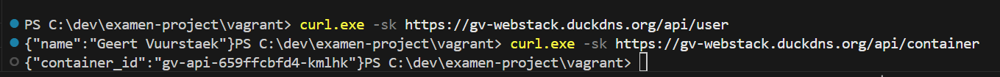
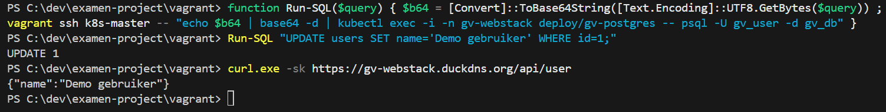
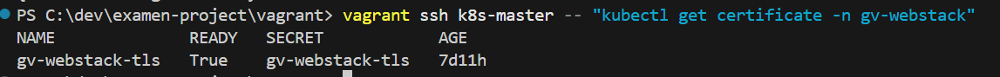
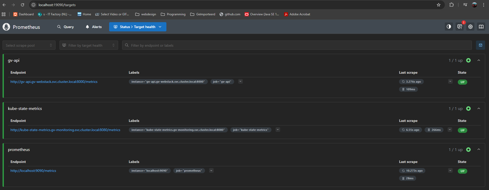
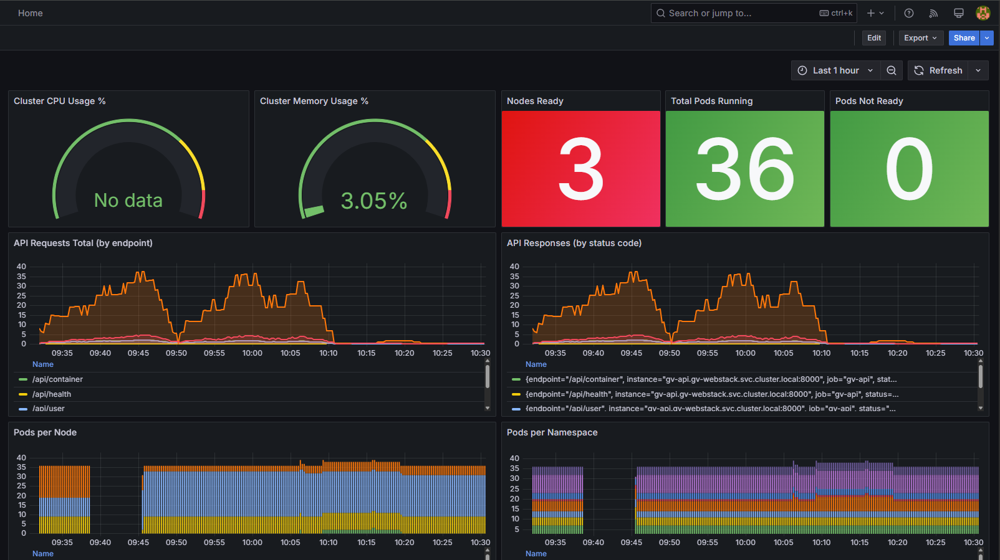
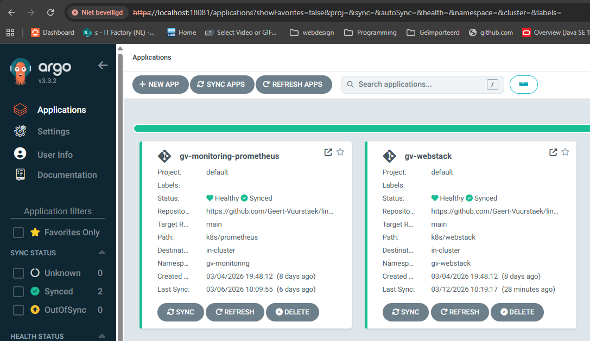

# Kubernetes Webstack — Examendocumentatie (GV)

## 1) Inleiding
In dit document beschrijf ik de volledige opbouw van mijn Kubernetes webstack met mijn initialen **GV** in namen van images, containers en resources. De oplossing bestaat uit drie containers: een frontend, een FastAPI backend en een PostgreSQL database. Alle stappen en commando's die ik heb uitgevoerd staan hieronder, inclusief uitleg van parameters en opties.

Dit document dient als naslagwerk voor de evaluatie. Tijdens het mondeling toon ik enkel wat al vóór de deadline is gebouwd en gedocumenteerd.

---

## 2) Opdrachtkoppeling en score-impact

### Basisvereisten
- **Docker stack**: aanwezig (`docker-compose.yaml`)  
- **Kubernetes cluster met minstens 1 worker**: aanwezig (kubeadm met 2 workers via Vagrant)

### Extra vereisten
- **HTTPS met geldig certificaat**: aanwezig (cert-manager + DuckDNS + TLS Ingress)
- **Extra worker + API scaling gespreid**: aanwezig (`replicas: 2` + pod anti-affinity)
- **Healthcheck met auto-restart bij unhealthy**: aanwezig (liveness/readiness probes op `/health`)
- **Monitoring met Prometheus**: aanwezig (Prometheus + kube-state-metrics + API metrics)
- **Kubeadm cluster met 1 controller + 2 workers + loadbalancing**: aanwezig
- **ArgoCD + GitOps workflow**: aanwezig (ArgoCD Applications met auto-sync)

---

## 3) Architectuur

### 3.1 Overzicht
```text
Browser
  -> Ingress NGINX (hosts: gv.local en gv-webstack.duckdns.org)
      -> /       -> Service gv-frontend -> Frontend pods
      -> /api    -> Service gv-api      -> API pods (2 replicas)
                                       -> Service gv-postgres -> PostgreSQL pod + PVC

Prometheus (gv-monitoring)
  -> scrape gv-api /metrics
  -> scrape kube-state-metrics

ArgoCD (argocd)
  -> sync van GitHub repo naar cluster
```

### 3.2 Nodes
| Node | IP | Rol |
|---|---|---|
| k8s-master | 192.168.56.10 | Control plane |
| k8s-worker1 | 192.168.56.11 | Worker |
| k8s-worker2 | 192.168.56.12 | Worker |

---

## 4) Stap-voor-stap uitvoering (met commando-uitleg)

> Uitgangspunt: PowerShell in map `vagrant/`.

### Stap 1 — Cluster opstarten
```powershell
cd vagrant
vagrant up
```

Uitleg:
- `cd vagrant`: ga naar de map met `Vagrantfile` en provisioning scripts.
- `vagrant up`: maakt de VMs aan en voert provisioning uit (containerd, kubeadm, join).

### Stap 2 — Images builden en naar alle nodes distribueren
```powershell
./build_and_distribute_images.ps1
```

Uitleg:
- Script bouwt `gv-api:1.3` en `frontend-apache` lokaal met Docker.
- Script maakt per image een `.tar` via `docker save` en uploadt die naar alle nodes.
- Op elke node wordt de image in containerd geladen via `ctr -n k8s.io images import`.
- Waarom: cluster gebruikt lokale images zonder externe registry dependency.

### Stap 3 — Kubernetes manifests uitrollen
```powershell
./deploy_manifests.ps1
```

Uitleg:
- Maakt namespaces aan (`gv-webstack`, `gv-monitoring`, `argocd`).
- Installeert ingress-nginx, MetalLB, ArgoCD, cert-manager.
- Past lokale manifests toe (`k8s/webstack`, `k8s/prometheus`, `k8s/argocd`, `k8s/ingress`).
- Doet readiness checks (`rollout status`, endpoint checks) en retries.

### Stap 4 — Ingress IP opzoeken en hosts invullen
```powershell
vagrant ssh k8s-master -- kubectl get svc -n ingress-nginx ingress-nginx-controller
```

Uitleg parameters:
- `vagrant ssh k8s-master --`: voer volgend commando uit op master VM.
- `kubectl get svc`: toon services.
- `-n ingress-nginx`: gebruik namespace `ingress-nginx`.
- `ingress-nginx-controller`: specifieke service met external IP.

Hosts file (Windows, admin):
```text
192.168.56.100  gv.local
192.168.56.100  gv-webstack.duckdns.org
```

### Stap 5 — Basisfunctionaliteit testen
```powershell
curl -sk https://gv-webstack.duckdns.org/api/user
curl -sk https://gv-webstack.duckdns.org/api/container
curl -sk https://gv-webstack.duckdns.org/api/health
```

Uitleg:
- `/api/user`: haalt naam uit PostgreSQL.
- `/api/container`: toont hostname/container-ID van API pod.
- `/api/health`: endpoint voor probes en snelle beschikbaarheidscontrole.
- `-k`: laat `curl` doorgaan bij lokale TLS-validatieproblemen tijdens demo's.

### Stap 6 — Naam in database live wijzigen (bewijs dynamische data)
```powershell
function Run-SQL($query) { $b64 = [Convert]::ToBase64String([Text.Encoding]::UTF8.GetBytes($query)) ; vagrant ssh k8s-master -- "echo $b64 | base64 -d | kubectl exec -i -n gv-webstack deploy/gv-postgres -- psql -U gv_user -d gv_db" }

Run-SQL "UPDATE users SET name='Demo Gebruiker' WHERE id=1;"
curl -sk https://gv-webstack.duckdns.org/api/user
Run-SQL "UPDATE users SET name='Geert Vuurstaek' WHERE id=1;"
```

Waarom deze aanpak:
- Base64 voorkomt quote-escaping problemen tussen PowerShell -> SSH -> Bash -> `psql`.
- `kubectl exec -i`: voert SQL uit in de PostgreSQL container.
- `-U gv_user -d gv_db`: user en databank expliciet ingesteld.

### Stap 7 — API scaling en spreiding over workers aantonen
```powershell
vagrant ssh k8s-master -- kubectl get pods -n gv-webstack -l app=gv-api -o wide
```

Uitleg parameters:
- `-l app=gv-api`: filter op API pods.
- `-o wide`: extra kolommen (node, pod IP, enz.) om spreiding te tonen.

Belangrijke nuance:
- In de huidige manifesten staat `preferredDuringSchedulingIgnoredDuringExecution` (voorkeur), geen harde verplichting.
- Daardoor mogen beide API pods op dezelfde worker terechtkomen als de scheduler dat op dat moment optimaal vindt.

Demo-tip om spreiding zichtbaar te maken zonder manifestwijziging:
```powershell
# 1) Tijdelijk worker1 unschedulable maken
vagrant ssh k8s-master -- kubectl cordon k8s-worker1

# 2) Eén API pod verwijderen zodat die opnieuw ingepland wordt
vagrant ssh k8s-master -- "kubectl delete pod -n gv-webstack -l app=gv-api --field-selector spec.nodeName=k8s-worker1 --grace-period=0 --force"

# 3) Controleren dat er een API pod op worker2 draait
vagrant ssh k8s-master -- kubectl get pods -n gv-webstack -l app=gv-api -o wide

# 4) Worker1 terug openzetten
vagrant ssh k8s-master -- kubectl uncordon k8s-worker1
```

GitOps-opmerking (belangrijk):
- Omdat ArgoCD op `origin/main` synchroniseert, moeten manifestwijzigingen ook naar GitHub gepusht worden.
- Anders kan ArgoCD je live-cluster terugzetten naar de oude toestand.

```powershell
cd C:\dev\examen-project
git add k8s/webstack/api-deployment.yaml k8s/webstack/frontend-deployment.yaml docs/solution.md docs/screenshots/
git commit -m "Enforce pod spread across workers with required anti-affinity"
git push origin main
```

### Stap 8 — Prometheus en Grafana tonen
Prometheus tunnel:
```powershell
vagrant ssh k8s-master -- "nohup kubectl port-forward --address 0.0.0.0 -n gv-monitoring svc/gv-prometheus 19090:9090 > /tmp/pf-prom.log 2>&1 & sleep 2 ; ss -lntp | grep 19090"
ssh -o StrictHostKeyChecking=no -o UserKnownHostsFile=NUL -o PubkeyAcceptedKeyTypes=+ssh-rsa -o HostKeyAlgorithms=+ssh-rsa -i "C:/dev/examen-project/vagrant/.vagrant/machines/k8s-master/virtualbox/private_key" -p 2222 -N -L 19090:localhost:19090 vagrant@127.0.0.1
```

Belangrijkste opties:
- `nohup ... &`: laat port-forward doorlopen in achtergrond op VM.
- `--address 0.0.0.0`: luistert op alle VM-interfaces.
- `-N -L 19090:localhost:19090`: SSH tunnel zonder remote shell, enkel local port forward.

### Stap 9 — ArgoCD toegang + initieel admin wachtwoord
```powershell
vagrant ssh k8s-master -- "nohup kubectl port-forward --address 0.0.0.0 -n argocd svc/argocd-server 18081:443 > /tmp/pf-argocd.log 2>&1 & sleep 2 ; ss -lntp | grep 18081"
ssh -o StrictHostKeyChecking=no -o UserKnownHostsFile=NUL -o PubkeyAcceptedKeyTypes=+ssh-rsa -o HostKeyAlgorithms=+ssh-rsa -i "C:/dev/examen-project/vagrant/.vagrant/machines/k8s-master/virtualbox/private_key" -p 2222 -N -L 18081:localhost:18081 vagrant@127.0.0.1
vagrant ssh k8s-master -- "kubectl -n argocd get secret argocd-initial-admin-secret -o jsonpath='{.data.password}' | base64 -d"
```

Uitleg laatste commando:
- `get secret argocd-initial-admin-secret`: leest het initieel admin secret.
- `-o jsonpath='{.data.password}'`: haalt enkel het password veld op.
- `| base64 -d`: decodeert van base64 naar leesbare tekst.

---

## 5) Configuratiebestanden en uitleg van belangrijke lijnen

### 5.1 Docker

#### `docker-compose.yaml`
- `services.gv-postgres.image: postgres:16`: officiële PostgreSQL image.
- `volumes: ./db/init.sql:/docker-entrypoint-initdb.d/init.sql:ro`: init-script wordt 1x uitgevoerd bij init van databank.
- `gv-api.environment`: DB-connectie via service naam `gv-postgres`.
- `gv-frontend.ports: "8080:80"`: frontend beschikbaar op localhost:8080.

### 5.2 API

#### `api/main.py`
- `@app.get("/user")`: leest `name` uit tabel `users` op `id=1`.
- retry-logica in `get_conn()` en `get_user()`: verhoogt robuustheid bij opstart-race met DB.
- `@app.get("/container")`: retourneert hostname van container, gebruikt voor schaalbewijs.
- `@app.get("/health")`: gebruikt door liveness/readiness probes.
- Prometheus metrics:
  - `REQUEST_COUNT` (`api_requests_total`)
  - `RESPONSE_COUNT` (`api_responses_total`)
  - `DB_QUERY_SECONDS` (queryduur histogram)

### 5.3 Frontend

#### `frontend/index.html`
- `const apiBase = "/api"`: frontend gebruikt altijd Ingress routepad.
- cache-busting querystring (`_=${Date.now()}-${Math.random()}`): vermijdt browser cache.
- `fetchJson("/user")` en `fetchJson("/container")`: vult pagina met naam en container-ID.

### 5.4 Database

#### `db/init.sql`
- `CREATE TABLE IF NOT EXISTS users`: idempotente tabelcreatie.
- `INSERT ... ON CONFLICT (id) DO UPDATE`: seed data blijft reproduceerbaar bij herstart.

### 5.5 Kubernetes webstack

#### `k8s/webstack/api-deployment.yaml`
- `replicas: 2`: schaalvereiste voor API.
- `strategy.rollingUpdate.maxSurge: 0` en `maxUnavailable: 1`: voorkomt extra tijdelijke pod die niet schedulebaar is bij strikte anti-affinity op 2 workers.
- `podAntiAffinity`: probeert pods op verschillende nodes te plaatsen.
- `env` + `secretKeyRef`: credentials uit Secret, niet hardcoded in image.
- `livenessProbe` + `readinessProbe` op `/health`: auto-restart en correcte traffic gating.

#### `k8s/webstack/api-service.yaml`
- `type: NodePort` en `nodePort: 30080`: API intern en extern bereikbaar voor tests.
- `prometheus.io/*` annotaties: documenteert scrape intentie.

#### `k8s/webstack/frontend-deployment.yaml`
- `replicas: 2`: frontend schaalbaar.
- `strategy.rollingUpdate.maxSurge: 0` en `maxUnavailable: 1`: rollout blijft mogelijk zonder `Pending` pods bij verplichte spreiding.
- `imagePullPolicy: IfNotPresent`: gebruikt lokale geladen image op nodes.

#### `k8s/webstack/postgres-deployment.yaml`
- `envFrom.secretRef`: DB variabelen uit Secret.
- `persistentVolumeClaim.claimName: gv-postgres-pvc-v2`: persistente opslag.
- mount `init.sql` via ConfigMap op `/docker-entrypoint-initdb.d/init.sql`.

#### `k8s/webstack/postgres-pv.yaml` + `postgres-pvc.yaml`
- `5Gi` opslag.
- `persistentVolumeReclaimPolicy: Retain`: data blijft bewaard na PVC-delete.
- `hostPath: /var/lib/gv-postgres-v2`: lokale node storage voor labomgeving.

### 5.6 Ingress, TLS en loadbalancing

#### `k8s/ingress.yaml`
- Hosts: `gv.local` (HTTP) en `gv-webstack.duckdns.org` (HTTPS).
- Path routing:
  - `/api` -> service `gv-api:8000`
  - `/` -> service `gv-frontend:80`
- `nginx.ingress.kubernetes.io/ssl-redirect: "true"`: forceert HTTPS op TLS-host.

#### `k8s/cert-manager/certificate.yaml`
- `issuerRef.kind: ClusterIssuer`: centraal cert issuer object.
- `dnsNames: gv-webstack.duckdns.org`: certificaat voor publiek domein.
- `duration: 2160h`, `renewBefore: 720h`: 90 dagen geldigheid, vernieuwing 30 dagen op voorhand.

#### `k8s/metallb/ip-pool.yaml`
- `IPAddressPool 192.168.56.100-192.168.56.120`: externe IP-range voor LoadBalancer services.
- `L2Advertisement`: adverteert IP's op layer 2 in lokaal netwerk.

### 5.7 Monitoring

#### `k8s/prometheus/prometheus-configmap.yaml`
- `scrape_interval: 15s`: resolutie van scraping.
- jobs:
  - `prometheus` (self-scrape)
  - `gv-api` (`/metrics` op service DNS)
  - `kube-state-metrics`

#### `k8s/prometheus/kube-state-metrics.yaml`
- `ClusterRole` met read-only `list/watch` op cluster objecten.
- `ClusterRoleBinding` koppelt rechten aan ServiceAccount.
- deployment exposeert metrics op poort 8080.

### 5.8 GitOps

#### `k8s/argocd/application.yaml`
- `repoURL`, `targetRevision`, `path`: bron van manifests in GitHub.
- `syncPolicy.automated.prune: true`: verwijdert obsolete resources.
- `syncPolicy.automated.selfHeal: true`: corrigeert drift automatisch.

#### `k8s/argocd/monitoring-prometheus.yaml`
- aparte ArgoCD application voor monitoring stack in `gv-monitoring` namespace.

---

## 6) Bewijsvoering en screenshots (vereist)

Onderstaande placeholders zijn klaar om te vervangen met je eigen proof-screenshots.
Plaats de bestanden in `docs/screenshots/` met exact deze namen.

### Screenshot 01 — Cluster nodes
Commando in beeld: `kubectl get nodes`



Bijschrift: 3 nodes zichtbaar (1 control-plane + 2 workers) met status `Ready`.

### Screenshot 02 — Pods en node spreiding
Commando in beeld: `kubectl get pods -n gv-webstack -o wide`



Bijschrift: API en frontend pods draaien verdeeld over worker nodes.

### Screenshot 03 — Frontend via HTTPS
Pagina in beeld: `https://gv-webstack.duckdns.org`



Bijschrift: frontend toont naam en API container-ID via Ingress.

### Screenshot 04 — API endpoints
Commando's in beeld: `curl -sk https://gv-webstack.duckdns.org/api/user` en `curl -sk https://gv-webstack.duckdns.org/api/container`



Bijschrift: endpoint `/api/user` geeft naam, `/api/container` geeft container-ID.

### Screenshot 05 — Live database update proof
Commando's in beeld: SQL update + `curl http://gv.local/api/user`



Bijschrift: naamwijziging in PostgreSQL wordt na refresh direct zichtbaar in API/frontend.

### Screenshot 06 — TLS certificaat status
Commando in beeld: `kubectl get certificate -n gv-webstack`



Bijschrift: certificate `gv-webstack-tls` staat op `READY=True`.

### Screenshot 07 — Prometheus targets
Pagina in beeld: `http://localhost:19090/targets`



Bijschrift: targets `gv-api` en `kube-state-metrics` staan op `UP`.

### Screenshot 08 — Grafana dashboard
Pagina in beeld: `http://localhost:13000`



Bijschrift: dashboard toont cluster metrics en API verkeer.

### Screenshot 09 — ArgoCD sync status
Pagina in beeld: `https://localhost:18081`



Bijschrift: ArgoCD applications staan op `Synced` en `Healthy`.

---

## 7) Korte evaluatiechecklist (mondeling)

- [ ] Ik toon dat de stack uit exact 3 containers bestaat: frontend, API, PostgreSQL.
- [ ] Ik toon dat de API naam uit de database leest en dat wijziging live zichtbaar is na refresh.
- [ ] Ik toon container-ID wissel door meerdere API replicas.
- [ ] Ik toon healthchecks (probes) en leg uit wat liveness/readiness doen.
- [ ] Ik toon HTTPS certificaat (geldig publiek cert).
- [ ] Ik toon Prometheus targets en minstens één metricquery.
- [ ] Ik toon ArgoCD auto-sync op basis van repo.
- [ ] Ik toon dat resource-namen en image-namen mijn initialen GV gebruiken.

---

## 8) Conclusie
De gevraagde webstack is succesvol gebouwd en gedeployed op een kubeadm-cluster met drie nodes (1 controller, 2 workers). Alle kernvereisten zijn aantoonbaar aanwezig: frontend + API + database, live databankupdates, API scaling over meerdere nodes, healthchecks, HTTPS met publiek certificaat, Prometheus monitoring en ArgoCD GitOps.

Door elke stap, elk commando en de belangrijkste configuratieregels expliciet te documenteren, is deze oplossing reproduceerbaar en geschikt als professioneel evaluatiedossier.
