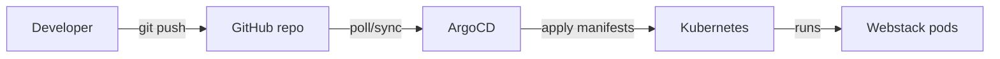

# Kubernetes Webstack - GV

## Overzicht
Deze oplossing bevat een 3-container webstack:
- Frontend (Apache) serveert een JavaScript pagina.
- FastAPI backend met endpoints:
  - GET /user: haalt de naam uit PostgreSQL.
  - GET /container: geeft de container ID (hostname).
- PostgreSQL database met de naam.

De frontend haalt de naam op via de API. Als de naam in de database verandert, is de nieuwe waarde zichtbaar na een refresh van de pagina.

## Architectuurschema (tekst)
Client -> Ingress (gv.local) ->
- / -> gv-frontend service -> gv-frontend pod
- /api/* -> gv-api service -> gv-api pods -> gv-postgres service -> gv-postgres pod

## Werking van de applicatie (kort)
De browser laadt de frontend via de Ingress en de JavaScript haalt de naam en container ID op via de API. De API leest de naam uit PostgreSQL en exposeert ook metrics voor Prometheus. Door ArgoCD worden wijzigingen in de repo automatisch toegepast op het cluster.

**Architectuurdiagram (NL)**
```mermaid
flowchart LR
  U[User browser] -->|HTTP| I[Ingress gv.local]
  I -->|/| FE[Frontend Service]
  I -->|/api| API[API Service]
  FE --> FEPOD[Frontend Pod]
  API --> APIPODS[API Pods]
  APIPODS --> DB[Postgres Service]
  DB --> DBPOD[Postgres Pod]
  APIPODS --> METRICS[/metrics]
  PROM[Prometheus] --> METRICS
```

**GitOps flow (NL)**

```mermaid
flowchart LR
  DEV[Developer] -->|git push| REPO[GitHub repo]
  REPO -->|poll/sync| ARGO[ArgoCD]
  ARGO -->|apply manifests| K8S[Kubernetes]
  K8S -->|runs| APP[Webstack pods]
```

## Broncode
Projectstructuur:
- frontend/
  - index.html
  - Dockerfile
- api/
  - main.py
  - requirements.txt
  - Dockerfile
- db/
  - init.sql
- k8s/
  - namespace.yaml
  - webstack/
    - postgres-secret.yaml
    - postgres-configmap.yaml
    - postgres-deployment.yaml
    - postgres-service.yaml
    - api-deployment.yaml
    - api-service.yaml
    - frontend-deployment.yaml
    - frontend-service.yaml
  - ingress.yaml
  - prometheus/
    - prometheus-configmap.yaml
    - prometheus-deployment.yaml
    - prometheus-service.yaml
    - kube-state-metrics.yaml
  - argocd/
    - application.yaml
    - monitoring-prometheus.yaml
  - metallb/
    - ip-pool.yaml
- docker-compose.yaml

## Docker (basis 5/20)
1) Build en start:
- docker compose up --build

2) Open frontend:
- http://localhost:8080

## Kubernetes cluster (kubeadm + Vagrant)
### 1) VMs opstarten en provisionen
- cd vagrant
- vagrant up

### 2) Images bouwen en distribueren
- bash build_and_distribute_images.sh

### 3) Manifests deployen (incl. ingress-nginx, MetalLB, ArgoCD, namespaces)
- bash deploy_manifests.sh

### 4) Hosts entry
- Neem het EXTERNAL-IP van de ingress-nginx LoadBalancer (MetalLB pool 192.168.56.100-192.168.56.120) en voeg toe:
- `<EXTERNAL-IP> gv.local`

### 5) Toegang
- Web: http://gv.local
- API: http://gv.local/api/user en /api/container

### 6) Monitoring toegang
- Prometheus: http://192.168.56.12:31025/targets

### 6) Handmatige apply (indien nodig)
- kubectl apply -f k8s/namespace.yaml
- kubectl apply -f k8s/metallb/ip-pool.yaml
- kubectl apply -f k8s/webstack/
- kubectl apply -f k8s/ingress.yaml

### 7) Testen
- Open http://gv.local
- API test:
  - http://gv.local/api/user
  - http://gv.local/api/container

## Kubernetes cluster (kubeadm) - 1 controller + 2 workers
Deze optie levert de +4 punten op. Hieronder staat een beknopte, reproduceerbare setup.

### Vereisten (alle nodes)
- Ubuntu 22.04 LTS of vergelijkbaar
- 2 CPU, 2 GB RAM per node (minimaal)
- Hostnames: gv-control, gv-worker-1, gv-worker-2
- Tijdsync en swap uit:
  - sudo swapoff -a
  - sudo sed -i '/ swap / s/^/#/' /etc/fstab

### 1) Container runtime (containerd)
- sudo apt-get update
- sudo apt-get install -y containerd
- sudo mkdir -p /etc/containerd
- sudo containerd config default | sudo tee /etc/containerd/config.toml
- sudo systemctl restart containerd
- sudo systemctl enable containerd

### 2) Kubernetes repo + tools
- sudo apt-get update
- sudo apt-get install -y apt-transport-https ca-certificates curl
- sudo curl -fsSLo /usr/share/keyrings/kubernetes-archive-keyring.gpg https://packages.cloud.google.com/apt/doc/apt-key.gpg
- echo "deb [signed-by=/usr/share/keyrings/kubernetes-archive-keyring.gpg] https://apt.kubernetes.io/ kubernetes-xenial main" | sudo tee /etc/apt/sources.list.d/kubernetes.list
- sudo apt-get update
- sudo apt-get install -y kubelet kubeadm kubectl
- sudo apt-mark hold kubelet kubeadm kubectl

### 3) Init controller (op gv-control)
- sudo kubeadm init --pod-network-cidr=10.244.0.0/16
- mkdir -p $HOME/.kube
- sudo cp /etc/kubernetes/admin.conf $HOME/.kube/config
- sudo chown $(id -u):$(id -g) $HOME/.kube/config

### 4) Pod network (Flannel)
- kubectl apply -f https://raw.githubusercontent.com/flannel-io/flannel/master/Documentation/kube-flannel.yml

### 5) Workers joinen
Gebruik het join-commando dat kubeadm init toont, bv.:
- sudo kubeadm join <controller-ip>:6443 --token <token> --discovery-token-ca-cert-hash sha256:<hash>

### 6) Ingress controller (NGINX)
- kubectl apply -f https://raw.githubusercontent.com/kubernetes/ingress-nginx/main/deploy/static/provider/cloud/deploy.yaml

### 7) LoadBalancer (MetalLB)
MetalLB zorgt voor een extern IP voor de Ingress controller.
- kubectl apply -f https://raw.githubusercontent.com/metallb/metallb/v0.14.5/config/manifests/metallb-native.yaml
- kubectl wait -n metallb-system --for=condition=Available deploy/controller --timeout=120s
- Maak een IP pool (pas het subnet aan aan je LAN):
  - kubectl apply -f k8s/metallb/ip-pool.yaml
  - Kies een vrij IP-bereik binnen je LAN subnet, bv. 192.168.1.240-192.168.1.250.

### 8) Applicatie deployen
Zelfde manifests als hierboven:
- kubectl apply -f k8s/namespace.yaml
- kubectl apply -f k8s/postgres-secret.yaml
- kubectl apply -f k8s/postgres-configmap.yaml
- kubectl apply -f k8s/postgres-deployment.yaml
- kubectl apply -f k8s/postgres-service.yaml
- kubectl apply -f k8s/api-deployment.yaml
- kubectl apply -f k8s/api-service.yaml
- kubectl apply -f k8s/frontend-deployment.yaml
- kubectl apply -f k8s/frontend-service.yaml
- kubectl apply -f k8s/ingress.yaml

### 9) Verifiëren
- kubectl get nodes
- kubectl get pods -n gv-webstack -o wide
- kubectl get svc -n ingress-nginx
- Open de Ingress via het MetalLB IP: http://<ingress-external-ip>

## Extra punten (mogelijk)
### Healthcheck
De API deployment bevat liveness en readiness probes op /health.

### Extra worker node + API scaling
- Vagrant cluster heeft 1 master + 2 workers.
- gv-api heeft replicas: 2 en toont de container ID in de frontend.
- Verifiëren dat replicas over nodes verdeeld zijn:
  - kubectl get nodes
  - kubectl get pods -n gv-webstack -l app=gv-api -o wide

### Prometheus monitoring
Prometheus draait in de namespace gv-monitoring.
De API exposeert /metrics en wordt gescrapet samen met kube-state-metrics.

Installatie:
- kubectl apply -f k8s/prometheus/prometheus-configmap.yaml
- kubectl apply -f k8s/prometheus/prometheus-deployment.yaml
- kubectl apply -f k8s/prometheus/prometheus-service.yaml
- kubectl apply -f k8s/prometheus/kube-state-metrics.yaml

Toegang:
- Open http://192.168.56.12:31025/targets

Metrics test (curl):
- curl http://gv.local/api/metrics

### ArgoCD (Helm + GitOps)
ArgoCD wordt met Helm geinstalleerd en volgt een Git repo voor automatische deploys.

1) Repo vullen met manifests
- Maak folder `k8s/` in je repo en zet al je Kubernetes manifests daarin (namespace, db, api, frontend, ingress, monitoring indien gewenst).
- Commit en push naar: https://github.com/Geert-Vuurstaek/linuxweb.git (branch: main).

2) ArgoCD installeren met Helm
- helm repo add argo https://argoproj.github.io/argo-helm
- helm repo update
- helm install gv-argocd argo/argo-cd --namespace argocd --create-namespace

3) ArgoCD UI openen (port-forward)
- kubectl port-forward -n argocd svc/gv-argocd-argocd-server 8081:443
- Open https://localhost:8081

4) Admin password ophalen
- kubectl get secret -n argocd gv-argocd-argocd-initial-admin-secret -o jsonpath="{.data.password}" | base64 --decode

5) Applicatie registreren
- kubectl apply -f k8s/argocd/application.yaml

6) Monitoring registreren (aparte apps)
- kubectl apply -f k8s/argocd/monitoring-prometheus.yaml

7) GitOps workflow
- Elke wijziging in de repo (k8s/) wordt automatisch toegepast door ArgoCD.
- `syncPolicy.automated` zorgt voor auto-sync + self-heal.

### Troubleshooting Targets
- Controleer API service/NodePort: `kubectl get svc -n gv-webstack gv-api -o wide`
- Controleer kube-state-metrics service/NodePort: `kubectl get svc -n gv-monitoring kube-state-metrics -o wide`
- Controleer Prometheus targets: http://192.168.56.12:31025/targets
- Test metrics direct:
  - `curl http://gv.local/api/metrics`
  - `curl http://192.168.56.12:30081/metrics`

## Wijzigen van de naam
1) Update in database:
- kubectl exec -n gv-webstack deploy/gv-postgres -- psql -U gv_user -d gv_db -c "UPDATE users SET name='Geert Vuurstaek' WHERE id=1;"

2) Refresh de frontend pagina om de nieuwe naam te zien.

## Layout wijziging
- Pas frontend/index.html aan.
- Bouw het image opnieuw en distribueer/herstart de deployment:
  - docker build -t gv-frontend:1.0 ./frontend
  - cd vagrant && ./build_and_distribute_images.ps1
  - kubectl rollout restart -n gv-webstack deployment/gv-frontend

## Uitleg van de belangrijkste configuratie
- Ingress: routeert / naar frontend en /api/* naar API.
- API deployment: gebruikt env vars uit secret, health probes op /health, en topology spread om pods over nodes te verdelen.
- API metrics: request count per endpoint, response count per status code, en DB query latency via Prometheus.
- Postgres init: init.sql maakt de users tabel en vult id=1.

## Screenshots
Voeg hier screenshots toe van:
- kubeadm cluster nodes
- pods in gv-webstack namespace
- frontend in browser
- API responses
- update van naam in DB

## Proof checklist (screenshots)
- kubeadm cluster met 2 workers: `kubectl get nodes`
- API pods gespreid over nodes: `kubectl get pods -n gv-webstack -l app=gv-api -o wide`
- Frontend met naam + container ID zichtbaar
- API `/user` en `/container` in browser of curl
- DB update + page refresh (nieuwe naam zichtbaar)
- Prometheus Targets page met `gv-api` op `UP`
- Prometheus Graph met `up{job="gv-api"}`

## Conclusie
Deze oplossing levert een 3-container webstack die draait op een kubeadm cluster met Vagrant (1 control-plane + 2 workers), en voldoet aan de gevraagde API endpoints en database integratie.
